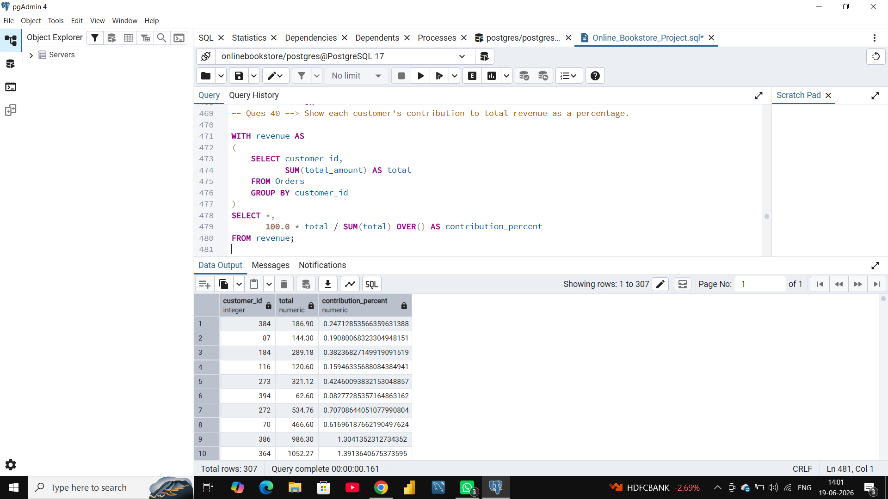
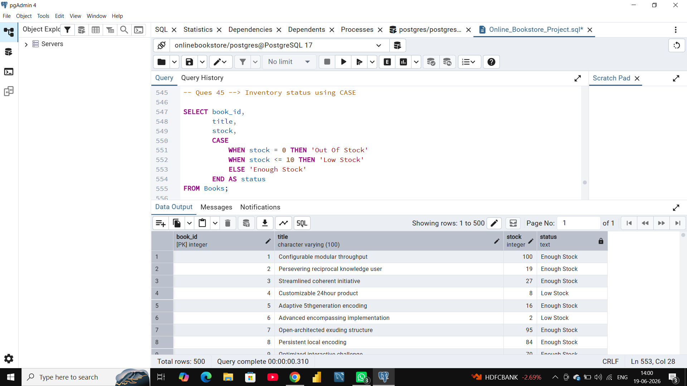
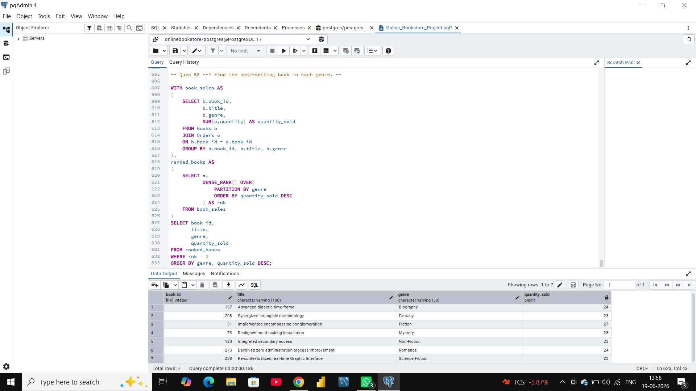

# BookStore Sales Analysis (PostgreSQL)

## Project Overview

This project analyzes bookstore sales data using PostgreSQL. The goal is to answer business questions related to sales, customers, inventory, revenue, and book performance.

## Database Schema

The project consists of three tables:

- Books
- Customers
- Orders

## SQL Concepts Used

- Joins
- Aggregate Functions
- GROUP BY & HAVING
- CASE WHEN
- Subqueries
- Common Table Expressions (CTEs)
- Date Functions
- Window Functions
- Ranking Functions

## Business Questions Solved

### Sales Analysis
- Total revenue generated
- Revenue by year and month
- Top customers by spending
- Customer contribution percentage

### Customer Analysis
- Repeat customers
- Customer lifetime value (CLV)
- Customers who never placed orders

### Inventory Analysis
- Remaining stock after orders
- Unsold books
- Inventory status classification

### Book & Genre Analysis
- Top-selling genre
- Least-selling genre
- Best-selling book in each genre
- Revenue by author

## Technologies Used

- PostgreSQL
- SQL

## Author

Arpita

## Project Screenshots

### Revenue Contribution

### Inventory Status

### Best Selling Book

